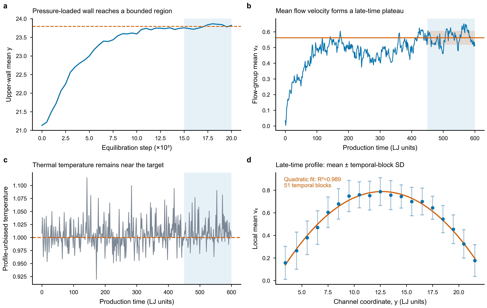

# LAMMPS `flow/in.flow.pois`：二维受力 Poiseuille 流

> 案例类型：A类官方桥接案例  
> 当前主输入：`in.flow.pois.stable`  
> Codex复现状态：稳定版已通过教学级扩展验收  
> 文档定位：统一保存案例事实、版本迭代、修改思路、稳定版代码教学、`dat` 数据读取方法和正式结果。

[返回网站首页](../index.md)

## 0. 先看这里：三个输入文件分别是什么

这个案例先后保留了三个输入文件。它们不是三个可以互相替代的“最新版”，而是完整的问题解决过程。

| 文件 | 定位 | 当前结论 |
|---|---|---|
| `in.flow.pois` | LAMMPS官方基准版 | 可以复现官方示例；保留原始教学模型 |
| `in.flow.pois.profile` | 第一轮恒温改进版 | 证明 `temp/profile` 能控制去偏温度，但没有形成稳态流动 |
| `in.flow.pois.stable` | 最终稳定教学版 | 当前代码教学和结果分析的主线；通过本案例预先规定的扩展验收 |

`in.flow.pois.stable` 是改进后的稳定版，位于[下载输入文件](../../lammps-cases/in.flow.pois.stable)

`in.flow.pois` 是下载lammps时examples文件夹中的内容。

## 1. 案例概况与最终结论

### 1.1 案例研究什么

本案例在二维空间中创建420个等质量Lennard-Jones粒子：下壁60个、上壁60个、中间流体300个。流体位于两层粒子壁之间，并在生产阶段受到恒定的正 `x` 向体力。我们希望得到固定通道中的受力流动，并测量平均流速怎样随 `y` 方向位置变化。

这个模型使用LJ约化单位和近似WCA的排斥型粒子作用。它的作用是学习通道、壁面、外力、恒温、稳态和空间速度剖面之间的关系，不把数值直接解释成真实水的SI单位。

### 1.2 来源和运行环境

| 项目 | 内容 |
|---|---|
| 官方来源 | LAMMPS源码中的 `examples/flow/in.flow.pois` |
| 官方输入SHA-256 | `f34dd00afed713922c7efda01856b2c9dcf1efdf36c7cadc646252c24a146222` |
| 正式运行版本 | LAMMPS 22 Jul 2025 Update 4 |
| 计算资源 | 1个MPI进程、1个OpenMP线程 |
| 全体系粒子数 | 420 |
| 流体粒子数 | 300 |
| 正式生产时间 | `200000 × 0.003 = 600` LJ时间单位 |

### 1.3 最终得到什么

稳定版先让受压上壁在没有流向驱动时平衡20000步，再固定平衡后的上壁、施加较小的 `x` 向体力并生产运行200000步。正式结果为：

| 指标 | 结果 |
|---|---:|
| 上壁平衡末段平均高度 | 23.794 |
| 上壁平衡末段高度范围 | 0.147 |
| 后期流体平均 `v_x` | `0.562 ± 0.044` |
| 后期窗口相对流速漂移 | 6.87% |
| 后期去偏温度 | `1.009 ± 0.023` |
| 半时间步长后期平均 `v_x` | 0.529 |
| 两种时间步长平均流速相对差 | 6.09% |
| 速度剖面二次拟合 | `R²=0.989` |
| 中心区域平均 `v_x` | 0.760 |
| 两侧近壁平均 `v_x` | 0.231 |
| `Dangerous builds` | 平衡0；生产0 |
| ERROR、WARNING、Lost atoms | 0 |

因此，稳定版同时满足：数值运行可靠、生产几何固定、去偏温度稳定、平均流速形成统计平台、减半时间步长不改变主要结论，以及中心快、近壁慢的Poiseuille型速度剖面。

---

## 2. 先理解物理：代码准备建立怎样的流动

### 2.1 坐标方向和边界

本案例的物理自由度是二维的：

```text
x：流动方向
y：上下壁之间的法向方向
z：LAMMPS通用命令仍保留该分量，但二维运动中被约束为零
```

`x` 方向是周期边界。粒子从右侧离开后会从左侧重新进入，因此模型中没有真实的入口和出口。`y` 方向使用收缩包围边界，但 `s` 只控制模拟盒范围，不会自动生成物理墙；真正阻挡流体的是上下两层粒子壁。

### 2.2 流体为什么向正 `x` 方向运动

生产阶段给每个流体粒子持续增加正向力：

```lammps
fix drive flow addforce ${drive} 0.0 0.0
```

周期通道中没有直接设置入口—出口压差。均匀体力在动量方程中充当压力梯度的等效驱动，使流体获得正 `x` 向动量。

### 2.3 为什么中心快、近壁慢

所有流体粒子都受到相同的正向驱动力，但近壁粒子会更频繁地与壁面交换动量，因此平均速度较低；通道中部受壁面作用较弱，平均速度较高。理想连续介质平板通道流具有类似

\[
u_x(y)\propto y(H-y)
\]

的开口向下剖面。本例是小型粒子模型，最终只用这一形状作为定性和教学级定量检查，不要求逐点等于连续介质解析式。

### 2.4 稳态要求的是动量收支平衡

整个流体组的流向动量满足近似关系：

\[
\frac{dP_x}{dt}=F_{\mathrm{drive}}+F_{\mathrm{wall}}.
\]

如果驱动力输入的正向动量大于壁面吸收的反向动量，平均流速会持续增加。只有长期平均满足

\[
\left\langle F_{\mathrm{drive}}+F_{\mathrm{wall}}\right\rangle\approx0
\]

时，平均流速才会围绕一个稳定水平波动。温度稳定不能代替这项检查，因为温度控制和宏观动量平衡是两件不同的事。

### 2.5 一个粒子的速度包含定向流动和热运动

流体粒子的瞬时速度可以写成：

\[
v_{x,i}=u_x(y_i)+v'_{x,i},
\]

其中 `u_x(y_i)` 是该高度的平均定向流速，`v'_{x,i}` 是相对于局部平均流动的随机热涨落。普通温度会把完整速度的动能算进去；`temp/profile` 则先估计并扣除各层平均 `v_x`，再用剩余速度计算热温度。

这解释了一个看似矛盾的现象：第一轮改进版中 `c_thermal≈1`，但平均流速仍能持续增加。恒温器控制住的是随机热运动，不是各层平均流速。

---

## 3. 从官方版到稳定版：修改是怎样想出来的

### 3.1 官方基准版先解决“能否原样运行”

官方 `in.flow.pois` 原样运行至10000步，420个粒子保持完整，热力学输出与安装目录中的2018年单进程参考日志在打印精度内一致。这个结果证明当前LAMMPS环境能够忠实执行官方案例。

官方日志包含 `Temperature for thermo pressure is not for group all` 警告：`thermo_modify temp mobile` 把 `flow` 组温度交给默认的全局压力计算，二者统计对象不同。官方参考日志中也有同一警告；它不阻止案例运行，但该 `Press` 不应作为严格全体系压力解释。稳定版不再输出这项默认压力，因此正式稳定日志中没有该警告。

官方版使用普通温度反馈给 `temp/rescale`。普通温度会包含定向流动动能，因此恒温器可能同时缩放热运动和希望保留的宏观流动。为分开两者，第一轮改进引入了 `temp/profile`。

### 3.2 第一轮改进的假设是合理的，但只解决了一个问题

`in.flow.pois.profile` 的核心修改是：

```lammps
compute      thermal flow temp/profile 1 0 0 y 10
fix_modify   2 temp thermal
```

原始假设是：沿 `y` 分层、扣除每层平均 `v_x` 后，恒温器只调整随机热运动，不再把Poiseuille流速当成高温而压低。

这个修改确实生效了。运行到10000步时，去偏温度仍约为1.0。然而结果同时暴露出更深的问题：

| 证据 | 实际表现 | 说明 |
|---|---:|---|
| 分箱加权平均流速 | 0.64逐块增加到12.60 | 流体仍接近持续加速，没有平台 |
| 普通温度 | 最终92.49 | 定向流动动能已经非常大 |
| 去偏温度 | 最终约1.0 | 热运动受控，但不能证明动量平衡 |
| 模拟盒体积 | 571.54 → 703.67 → 638.38 | 上壁和通道几何仍在调整 |
| `Dangerous builds` | 901 | 邻居表更新存在明显延迟风险 |

第一轮改进因此不能被描述成“恒温失败”。更准确的诊断是：

```text
去偏恒温基本实现
但驱动力、壁面平衡、固定几何、邻居表和采样时间仍不满足稳态测量条件
```

### 3.3 一个简单估算揭示驱动力过强

第一轮改进版中每个流体粒子的附加力为0.5，质量为1.0，所以忽略阻力时加速度为：

\[
a=F/m=0.5.
\]

10000步、时间步0.003对应总时间30，因此无阻力速度增加量约为：

\[
\Delta v=at=0.5\times30=15.
\]

实际末段平均流速约12.6，与15相差不大。这说明在这段运行中驱动力占主导，壁面还没有提供足以平衡它的平均阻力。此时仅仅继续运行会同时放大高速运动、壁面变化和邻居表风险，因此应该先调整模型。

### 3.4 稳定版逐项对应失败证据

| 第一轮证据 | 诊断 | 稳定版修改 | 用什么验证 |
|---|---|---|---|
| 流速持续增加 | 驱动力输入远大于已形成的壁面耗散 | 把驱动力从0.5降至0.02 | 后期 `v_flowVx` 的均值和斜率 |
| 上壁和体积变化 | 一边压壁、一边启动流动、一边统计，过程混杂 | 先无流向驱动平衡上壁，再固定几何 | `v_upperY`、`v_upperVy` 和体积 |
| 上壁长时间振荡 | 受压壁没有整体阻尼 | 平衡阶段增加 `fix viscous 2.0` | 平衡末段高度范围 |
| `Dangerous builds=901` | `delay 5` 对高速运动不够保守 | 改为 `delay 0 every 1 check yes` | 两阶段危险重建数 |
| 10000步内仍是启动过程 | 没有独立、足够长的生产阶段 | 平衡20000步，生产200000步 | 后期窗口是否形成平台 |
| 只看单一时间步 | 不知道结果是否受积分步长控制 | 用0.0015再运行相同物理时长 | 两种时间步的后期平均流速 |

### 3.5 为什么最终选择驱动力0.02

稳定结构建立后，先做短时驱动力筛选：

| 每粒子 `x` 向力 | 短运行后期平均流速（约） | 二次拟合（约） | 判断 |
|---:|---:|---:|---|
| 0.005 | `0.07 ± 0.03` | `R²=0.844` | 信号与热涨落相比较弱 |
| 0.010 | `0.23 ± 0.04` | `R²=0.910` | 能形成剖面，但早期时间步比较未满足10%阈值 |
| 0.020 | `0.50 ± 0.03` | `R²=0.975` | 信号清楚，并在长运行中通过时间步检查 |

驱动力不是越小越好：过大会造成持续加速和数值风险；过小则使宏观速度与热涨落难以区分，需要更多粒子和更长采样。0.02是在本教学体系的信号、稳定性和计算成本之间选出的工作参数。

短筛选只负责选参数。选定0.02并写明验收条件后，又进行了独立的200000步正式生产运行，没有直接把筛选中最好看的曲线当作最终证据。

---

## 4. 以 `in.flow.pois.stable` 为主线学习代码

稳定版的运行逻辑是：

```text
集中定义可调参数
    ↓
建立二维空间、粒子、分组和相互作用
    ↓
生成流体初始热速度
    ↓
阶段A：无流向驱动，让受压上壁带阻尼地寻找平衡高度
    ↓
撤销阶段A的上壁控制，清零速度并固定上壁
    ↓
阶段B：切换到去偏恒温，施加较小流向驱动力
    ↓
长期运行并输出速度剖面
```

### 4.1 把关键参数集中放在文件开头

```lammps
variable        drive index 0.02
variable        eqsteps index 20000
variable        prodsteps index 200000
variable        pistondamp index 2.0
```

这四个变量分别控制流向动量输入、上壁预平衡时长、正式生产时长和上壁振荡衰减强度。后面使用 `${drive}`、`${eqsteps}` 等引用变量，可以避免参数散落在不同位置，也让参数筛选更容易核对。

其中0.02、20000、200000和2.0都不是LAMMPS自动推导的普适值，而是当前稳定教学模型的设置。改变它们时，需要先写清预期观察量，而不是只看运行能否结束。

### 4.2 二维空间、边界和邻居表

```lammps
dimension       2
boundary        p s p

atom_style      atomic
neighbor        0.3 bin
neigh_modify    delay 0 every 1 check yes
```

当没有显式写 `units` 时，LAMMPS 会默认使用 `units lj`。质量、长度、能量、温度、时间和力都是约化量。

`dimension 2` 使粒子只具有二维平动自由度，但LAMMPS的通用命令仍使用 `x/y/z` 三个分量。二维模拟要求 `z` 方向为周期边界，所以 `boundary` 的第三项仍写 `p`。`boundary p s p` 中：`x` 周期、`y` 收缩包围、`z` 周期。

#### 邻居表为什么要改

LJ截断距离是1.12246，`neighbor 0.3 bin` 又增加0.3的skin缓冲，因此邻居候选表大致覆盖：

\[
r<1.12246+0.3=1.42246.
\]

真正的LJ力仍只在截断距离 `1.12246` 内计算；额外0.3用于提前收录可能很快靠近的粒子。使用 `check yes` 时，如果至少一个粒子自上次建表后移动约半个skin，即0.15，LAMMPS会认为需要重建。

旧版 `delay 5` 规定重建后至少等待5步。旧版末期平均流速约12.6，简单估算5步位移为：

\[
12.6\times0.003\times5=0.189>0.15.
\]

真正决定风险的是粒子相对运动，但这个估算已经说明强制等待5步可能过长。稳定版改成：

```text
delay 0：没有强制等待期
every 1：每一步都考虑是否需要重建
check yes：只有位移达到条件时才真正重建
```

因此它不是“每一步都重建”，而是“每一步都允许检查，必要时才重建”。`delay` 控制重建后的最短等待期，`every` 控制考虑重建的时间间隔，二者不能互相替代。[`neighbor`](https://docs.lammps.org/neighbor.html)；[`neigh_modify`](https://docs.lammps.org/neigh_modify.html)

### 4.3 晶格、模拟盒和420个初始粒子

```lammps
lattice         hex 0.7
region          box block 0 20 0 10 -0.25 0.25
create_box      3 box
create_atoms    1 box

mass            1 1.0
mass            2 1.0
mass            3 1.0
```

`lattice hex 0.7` 提供二维六角晶格点。在 `units lj` 下，`0.7` 表示约化数密度

\[
\rho^*=N\sigma^2/A=0.7,
\]

而不是晶格常数。这里是二维体系，所以密度是单位面积内的粒子数。LAMMPS会根据六角晶格的几何关系，反算满足该数密度的晶格常数。

二维六角晶格的一个原胞含2个晶格点，原胞面积为

\[
A_{\mathrm{cell}}=\sqrt{3}a^2,
\]

因此

\[
\rho^*=\frac{2}{\sqrt{3}a^2}=0.7,
\qquad
a=\sqrt{\frac{2}{\sqrt{3}\times0.7}}
\approx1.28436.
\]

这里的 `a≈1.28436` 是相邻原子的水平间距。相邻原子排在交错的水平行上，所以相邻两行的竖直距离为

\[
\Delta y=\frac{\sqrt{3}}{2}a\approx1.11229.
\]

LAMMPS用于换算 `region` 参数的晶格间距则是：

```text
x方向 lattice spacing = a ≈ 1.28436
y方向 lattice spacing = √3a ≈ 2.22457
```

注意，`y` 方向的 `lattice spacing` 包含两排交错原子，所以它是实际相邻原子行间距 `1.11229` 的两倍。这两个数不能混为一谈。

`region box` 没有写 `units box`，因此默认采用 `units lattice`。它给出的 `0—20` 和 `0—10` 是晶格坐标，换算后的盒子尺寸约为

```text
Lx = 20 × 1.28436 ≈ 25.6871
Ly = 10 × 2.22457 ≈ 22.2457
```

初始原子在 `y=0、1.11229、2.22457……22.24571` 等离散的水平行上。由于 `y` 是非周期边界，最上方边界上的一行也被创建出来，因此共有21行；每行20个原子，最终是

```text
21行 × 20个/行 = 420个原子
```

两个数字经常被误解：

- `create_box 3 box` 中的3是允许的原子类型总数，不是三维；
- `create_atoms 1 box` 中的1是新建原子的类型编号，不是只创建一个粒子。

`create_atoms 1 box` 只在盒内已有的晶格点上创建原子，不会把连续空间全部填满。此时420个原子全部是1型；三条 `mass` 则把三种类型的质量都设为1.0。

### 4.4 按初始位置建立静态分组，再改变类型

```lammps
region          1 block INF INF INF 1.25 INF INF
group           lower region 1
region          2 block INF INF 8.75 INF INF INF
group           upper region 2
group           boundary union lower upper
group           flow subtract all boundary

set             group lower type 2
set             group upper type 3
```

`region 1` 中的 `1` 是区域名称，通过坐标来划分区域；`group lower region 1` 引用区域1，为原子分组；`set ... type` 为原子指定原子类型。

普通 `group ... region` 在执行时建立静态成员表。上壁粒子以后即使离开最初的区域2，也仍属于 `upper`。[`group`](https://docs.lammps.org/group.html)；[`set`](https://docs.lammps.org/set.html)

`region 1` 和 `region 2` 是用于筛选已有原子的空间范围：

```text
region 1：所有x和z，y从负无穷到1.25
region 2：所有x和z，y从8.75到正无穷
```

这里的 `1.25` 和 `8.75` 仍是晶格单位。换成盒子单位，两条区域边界大约位于：

```text
下方筛选边界：1.25 × 2.22457 ≈ 2.78071
上方筛选边界：8.75 × 2.22457 ≈ 19.4650
```
四条 `group` 命令可以按集合运算理解：

```text
lower    = 初始时位于region 1中的原子
upper    = 初始时位于region 2中的原子
boundary = lower ∪ upper (union表示并集)
flow     = all − boundary（subtract表示减去）
```

因此，在420个已经存在的离散原子中，按照初始位置进行一次筛选：

```text
y ≤ 2.78071：选入lower
2.78071 < y < 19.4650：既不属于lower也不属于upper，稍后选入flow
y ≥ 19.4650：选入upper
```

结合前面算出的原子行间距 `1.11229`，初始分组实际上是：

```text
lower：y = 0、1.11229、2.22457，共3行
flow ：y = 3.33686、4.44914……18.90885，共15行
upper：y = 20.02114、21.13342、22.24571，共3行
```

每行20个原子，所以最终关系是：

```text
all：420个
├─ boundary：120个壁面原子
│  ├─ lower：3行，共60个，随后改成2型
│  └─ upper：3行，共60个，随后改成3型
└─ flow：15行，共300个，保持1型
```


### 4.5 三种类型使用同一套排斥型LJ作用

```lammps
pair_style      lj/cut 1.12246
pair_coeff      * * 1.0 1.0 1.12246
```

标准12-6 Lennard-Jones势为：

\[
U(r)=4\epsilon\left[\left(\frac{\sigma}{r}\right)^{12}-\left(\frac{\sigma}{r}\right)^6\right].
\]

这里 `ε=1.0`、`σ=1.0`，截断距离 `1.12246≈2^{1/6}σ`，即势能最低点附近。截断后主要保留短程排斥，因此动力学上接近WCA模型；由于没有 `pair_modify shift yes`，势能零点没有移到截断处，称为“近似WCA或WCA式排斥模型”更准确。

`pair_coeff * *` 覆盖三种类型的全部类型对：1—1、1—2、1—3、2—2、2—3和3—3。若写成 `pair_coeff 1 2 ...`，表示只设置1型与2型之间的交叉作用。[`pair_style lj/cut`](https://docs.lammps.org/pair_lj.html)

### 4.6 生成初始热速度，并准备两只温度计

```lammps
compute         mobile flow temp
velocity        flow create 1.0 482748 temp mobile
compute         thermal flow temp/profile 1 0 0 y 10
```

`compute mobile flow temp` 建立普通动能温度计算。`mobile` 只是用户定义的计算名称，不会让粒子运动。

`velocity flow create 1.0 482748 temp mobile` 表示为flow这组原子创造初始速度。创造过程和温度有关，`temp mobile` 指定用mobile这只温度计判断生成后的温度。流程是：

```text
给 flow 组的300个原子生成一组随机速度；
随机数种子是 482748；
用 mobile 这只温度计计算这些速度对应的温度（比如 ）；
将当前温度与目标温度 1.0 比较；
整体缩放随机速度;
使计算温度达到 1.0;

eg: 用 mobile 这只温度计计算速度对应的温度为Tcurrent=1.44，
温度与动能有关，动能与速度平方成正比，所以v_new/v_old=(Ttarget/Tcurrent)^（1/2）；
即 v_new/v_old=(1/1.44)^（1/2）
即 v_new=0.8333v_old
```


`compute thermal ... temp/profile 1 0 0 y 10` 沿 `y` 分成10层，只扣除各层平均 `x` 向速度，再用剩余速度计算整组流体的去偏温度。三个标志 `1 0 0` 分别表示扣除 `x` 平均速度、不扣除 `y/z` 平均速度。

假设同一层三个粒子的 `v_x` 是：

```text
0.8、1.2、1.6
```

层平均为1.2，扣除后进入热温度计算的 `x` 分量是：

```text
-0.4、0、+0.4
```

平均流动1.2被当作速度偏置保留。300个粒子分10层，平均约30个粒子一层，是教学级起点；层数过多时，单层粒子太少会使局部平均和温度估计不稳定。[`compute temp/profile`](https://docs.lammps.org/compute_temp_profile.html)

### 4.7 阶段A：无流向驱动地平衡受压上壁

```lammps
fix             integrate all nve
fix             thermostat flow temp/rescale 200 1.0 1.0 0.02 1.0
fix_modify      thermostat temp mobile

velocity        boundary set 0.0 0.0 0.0
fix             lowerhold lower setforce 0.0 0.0 0.0
fix             upperslide upper setforce 0.0 NULL 0.0
fix             upperload upper aveforce 0.0 -1.0 0.0
fix             upperdamp upper viscous ${pistondamp}
fix             planar all enforce2d
```

#### `nve` 和恒温器分工

`fix nve` 用速度Verlet算法推进全部420个粒子的位置和速度。`temp/rescale` 只负责按指定温度反馈缩放 `flow` 组速度，不能单独完成位置积分。体系还有恒温器、外载荷和阻尼，所以虽然用了 `fix nve`，整个过程不是封闭且总能量守恒的纯NVE系综。

`temp/rescale 200 1.0 1.0 0.02 1.0` 中各参数在本例的含义是：

| 参数 | 含义 |
|---|---|
| `flow` | 只调整flow这个原子组，即300个流体粒子的速度 |
| `200` | 每200步检查并在需要时缩放一次 |
| `1.0 1.0` | 运行起点和终点的目标温度均为1.0，即目标温度不随时间改变 |
| `0.02` | 当前温度与目标温度相差超过0.02时才调整 |
| 最后的 `1.0` | 一旦触发，就完全缩放到当时的目标温度 |

前面的 `velocity flow create 1.0 482748 temp mobile` 和当前的 `fix thermostat flow temp/rescale 200 1.0 1.0 0.02 1.0` 都使用了温度和速度的关系，都有缩放速度的过程，但负责的阶段和作用不同。前者是在初始阶段创造速度，后者是在运行阶段是控制温度。

平衡阶段没有流向驱动，普通温度已经能直接表示主要热运动，因此恒温器暂时使用 `mobile`。如果一开始就按10层扣除局部均速，少量粒子的随机分层平均可能被误认为已经建立的宏观流动。

`fix planar all enforce2d` 在运行期间持续把所有粒子的 `z` 向力和速度清零。`dimension 2` 规定二维模拟规则，`enforce2d` 则在时间推进中明确维持零 `z` 分量；这也是为什么通用命令仍写三个方向，却不会产生真实的第三维运动。

#### 下壁为什么固定

```lammps
velocity        boundary set 0.0 0.0 0.0
fix             lowerhold lower setforce 0.0 0.0 0.0
```

`velocity boundary set 0 0 0` 只把上下壁当前速度清零一次。真正让下壁持续固定的是：

```lammps
fix lowerhold lower setforce 0.0 0.0 0.0
```

`setforce` 每步覆盖已经计算出的力。假设下壁粒子的原力为 `(0.3,-0.2,0)`，覆盖后用于积分的力是 `(0,0,0)`。所以“当前速度为零 + 后续受力持续为零”才使下壁保持不动。[`fix setforce`](https://docs.lammps.org/fix_setforce.html)

#### 上壁怎样受压而不横向漂移

```lammps
fix             upperslide upper setforce 0.0 NULL 0.0
fix             upperload upper aveforce 0.0 -1.0 0.0
fix             upperdamp upper viscous ${pistondamp}
```

通过`setforce` 把上壁的 `x/z` 力设置为0，但用 `NULL` 保留原来的 `y` 力。
随后通过 `aveforce` 计算上壁原有组平均力，`x/z` 方向变为受力的平均值，`y` 方向要在受力平均值的基础上增加 `-1.0`。

`setforce`和`aveforce`不同：
`setforce`为直接设置数值，NULL表示保留原值，不设置。
`aveforce`要先计算平均值，以平均值为基础，所以出现0,1等数字代表在平均值的基础上增加0,1；出现NULL表示保留原值，不平均也不增加。[`fix aveforce`](https://docs.lammps.org/fix_aveforce.html)

#### 为什么增加 `viscous`

上壁在流体向上作用和外部向下载荷之间可能反复振荡。`fix viscous` 添加与速度方向相反的阻尼力：

\[
F_{\mathrm{damp}}=-\gamma v.
\]

它主要帮助上壁整体运动更快衰减，而不是独自决定最终平衡高度。没有阻尼时，上壁可能压缩流体后反弹，再次下落；加入阻尼后振幅逐渐减小，更快进入有界高度范围。

#### 为什么此阶段不施加 `x` 向驱动力

如果上壁受压移动的同时，流体又在高速启动，那么通道高度、密度、流动应力和速度剖面会一起变化。先关闭流向驱动，是为了单独回答：在温度约1.0和当前法向载荷下，上壁会进入怎样的平均高度。

### 4.8 时间步和直接诊断量

```lammps
timestep        0.003

variable        flowVx equal vcm(flow,x)
variable        upperY equal xcm(upper,y)
variable        upperVy equal vcm(upper,y)

thermo_style    custom step c_mobile c_thermal v_flowVx v_upperY v_upperVy epair etotal vol
thermo          500

print           "STAGE equilibration: pressure-loaded upper wall, no x drive"
run             ${eqsteps}
```

`vcm(flow,x)` 是整个 `flow` 组的质心 `x` 速度；由于流体质量相同，也可理解为300个流体粒子的平均 `v_x`。`xcm(upper,y)` 是上壁组质心的平均高度，不是盒子上边界或最高原子的坐标；`vcm(upper,y)` 是上壁整体的平均法向速度。

变量定义时名称是 `flowVx`，在输出命令中用 `v_flowVx` 引用；`c_mobile`、`c_thermal` 前面的 `c_` 表示引用compute结果。


#### `print` 是阶段标签，不是热力学计算

```lammps
print           "STAGE equilibration: pressure-loaded upper wall, no x drive"
```

程序执行到这条命令时，只输出一次引号中的文字。它默认显示在LAMMPS运行终端和日志中。

#### 输出项
| 输出项 | 物理含义 |
|---|---|
| `step` | 当前时间步 |
| `c_mobile` | `flow` 组普通温度 |
| `c_thermal` | 扣除分层平均 `v_x` 后的热运动温度 | 
| `v_flowVx` | 整个流体组的平均 `x` 速度 | 
| `v_upperY` | 上壁平均 `y` 位置 | 
| `v_upperVy` | 上壁平均 `y` 速度 | 
| `epair` | 粒子对相互作用势能 | 
| `etotal` | LAMMPS报告的总能量 | 
| `vol` | 模拟盒体积；本二维模型中主要跟随 `y` 向几何变化 | 

平衡阶段最关键的组合是：

```text
v_upperY：平均位置是否进入有界范围
v_upperVy：整体速度是否在0附近波动
```

不能因为某一步 `v_upperVy=0` 就宣布上壁平衡，因为它也可能恰好处在振荡的最高点或最低点。必须同时观察一段时间内的平均位置范围和平均速度。

生产阶段最关键的组合是：

```text
v_flowVx ：平均流速是否形成平台
c_thermal：热运动温度是否保持正常
v_upperY、vol：固定通道几何是否真的不再变化
```

例如 `v_flowVx` 看起来稳定，但 `v_upperY` 和 `vol` 仍持续变化，得到的仍可能是变宽通道中的瞬态；只有温度正常也不能证明流动动量已经平衡。这些量一起输出，是为了让“程序跑完”进一步成为可以检查的物理结果。

`epair` 对粒子靠得过近非常敏感，可用来发现严重重叠或时间步引起的异常；但正常热涨落和上壁调整都会让它变化，不要求恒定。本体系还存在驱动力、恒温、外载荷、阻尼和固定壁面约束，因此不是封闭纯NVE体系，也不能要求 `etotal` 严格守恒。这里关注的是突变、失控增长、`NaN` 或 `Inf`，而不是把能量的每次波动都判成错误。

### 4.9 从平衡阶段切换到固定几何生产阶段

```lammps
unfix           upperdamp
unfix           upperload
unfix           upperslide
velocity        upper set 0.0 0.0 0.0
fix             upperhold upper setforce 0.0 0.0 0.0
```

阶段A的控制目标是让上壁沿 `y` 运动、承受载荷并逐渐停止振荡；阶段B的目标改成固定上壁。先 `unfix` 完整撤销阻尼、载荷和滑动约束，可以避免多套力控制重叠，让新阶段的物理含义明确。

`fix` 通常是一条在后续时间步持续生效的规则；`unfix` 后面写的是该规则的ID。例如 `unfix upperload` 表示从此停止名为 `upperload` 的载荷控制。它不会倒退模拟，也不会撤销载荷过去已经造成的位置和速度变化，只影响后续时间步。

阶段切换并不要求删除所有 `fix`。`upperdamp`、`upperload` 和 `upperslide` 的任务只属于预平衡，因此要删除；`integrate`、`lowerhold` 和 `planar` 在生产阶段仍有相同作用，所以继续保留。

仅写 `setforce 0 0 0` 还不足以立即固定上壁。第一阶段末尾的瞬时速度可能不严格为0；零力只意味着以后没有加速度，已有速度仍会保留。因此必须先把上壁速度清零，再持续把三个方向的力设为0。

固定后的上壁代表一个外部位置约束。它与流体碰撞时，流体仍受到壁面反力；壁面传来的动量由外部固定约束吸收。这样生产阶段才有机会形成“驱动力输入动量≈固定壁面吸收动量”的统计平衡。

### 4.10 生产阶段切换为去偏恒温并施加驱动力

```lammps
unfix           thermostat
fix             thermostat flow temp/rescale 200 1.0 1.0 0.02 1.0
fix_modify      thermostat temp thermal

reset_timestep  0

fix             drive flow addforce ${drive} 0.0 0.0
```

`unfix thermostat` 删除了平衡阶段配置的恒温器；下一行立即重新建立生产阶段需要的恒温器。
判断一套恒温设置时，不能只看 `fix`，必须把它和紧随其后的 `fix_modify` 合起来看。平衡阶段使用了普通温度计`mobile`，生产阶段使用分层的`thermal`。

本输入文件采用“删除旧恒温器，再建立新恒温器”的阶段组织方式。`unfix` 后原ID被释放，因此新 `fix` 可以合法地继续使用 `thermostat` 这个名称。为了教学阅读，也可以把两套配置在概念上分别称为：

```text
thermostat_eq   ：平衡阶段恒温器，使用mobile
thermostat_prod ：生产阶段恒温器，使用thermal
```

`reset_timestep 0` 只把当前时间步编号重新设为0，不会删除平衡结构、重置坐标或重新生成速度。随后 `addforce` 在每个流体粒子的原有 `x` 向力上增加0.02，相当于持续给所有流体粒子提供正 `x` 方向的外部驱动力。例如原LJ力为 `-0.03`，最终用于积分的 `x` 向力是 `-0.03+0.02=-0.01`；它是力的相加，不是把最终力覆盖成0.02，也不是直接把速度增加0.02。[`fix addforce`](https://docs.lammps.org/fix_addforce.html)

由于本案例流体粒子质量为1，外力0.02单独贡献的瞬时加速度为 `a_x=F_x/m=0.02`。在一个时间步 `0.003` 内，如果暂时忽略其他力，它造成的速度增量约为：

\[
\Delta v_x=a_x\Delta t=0.02\times0.003=0.00006.
\]

真实模拟中还同时存在粒子间LJ力、壁面作用和恒温调节，所以流速不会简单地每步固定增加0.00006。启动阶段驱动力占优时平均流速上升；后期驱动力输入的动量与壁面吸收、流体内部传递等作用达到统计平衡后，平均流速才可能形成平台。

### 4.11 速度剖面与轨迹输出

```lammps
compute         flowbins flow chunk/atom bin/1d y lower 0.25 units box
fix             profile flow ave/chunk 10 100 1000 flowbins vx density/number &
                norm sample file velocity-profile-stable.dat

dump            trajectory all custom 500 trajectory-flow-stable.lammpstrj &
                id type x y xu yu vx vy
dump_modify     trajectory sort id
```

前两行共同完成一件事：沿通道法向 `y` 把流体划分成许多薄层，周期性计算每层的平均 `x` 向流速和数密度，再把时间平均结果写入 `velocity-profile-stable.dat`。它们只负责测量和输出，不会修改粒子的受力、速度或运动轨迹。

#### `compute flowbins`：每个流体粒子现在属于哪个空间分箱

第一条命令按下面的语法拆分：

```text
compute  flowbins  flow  chunk/atom  bin/1d  y  lower  0.25  units box
│        │         │     │           │       │  │      │     │
│        │         │     │           │       │  │      │     └─ 距离采用盒子单位
│        │         │     │           │       │  │      └────── 分箱厚度
│        │         │     │           │       │  └───────────── 从盒子下边界开始
│        │         │     │           │       └──────────────── 沿y方向划分
│        │         │     │           └──────────────────────── 一维分箱
│        │         │     └──────────────────────────────────── 给每个原子分配chunk编号
│        │         └────────────────────────────────────────── 只处理flow组
│        └──────────────────────────────────────────────────── compute ID
└───────────────────────────────────────────────────────────── compute命令
```

`flowbins` 是这条compute的ID，供下一条 `fix` 引用；`flow` 表示只给300个流体粒子分箱，不把上下壁的120个原子混入统计。

`chunk/atom bin/1d` 建立一维空间分箱。这里沿 `y` 划分，所以每个chunk是一条横跨整个 `x` 方向的薄层：

```text
       y
       ↑

┌──────────────────────┐
│       Chunk 4        │
├──────────────────────┤
│       Chunk 3        │
├──────────────────────┤
│       Chunk 2        │
├──────────────────────┤
│       Chunk 1        │
└──────────────────────┘ → x
```

`lower` 是分箱原点关键字，表示从模拟盒当前的 `y` 下边界开始划分；它不是前面名为 `lower` 的下壁原子组。如果盒子下边界为 `y_lo`，各分箱依次近似为：

```text
Chunk 1：y_lo        ≤ y < y_lo + 0.25
Chunk 2：y_lo + 0.25 ≤ y < y_lo + 0.50
Chunk 3：y_lo + 0.50 ≤ y < y_lo + 0.75
……
```

`0.25` 是每个薄层在 `y` 方向的厚度。`units box` 表示它使用当前LJ模拟盒的长度单位，不是0.25个晶格间距，也不是盒子高度的25%。分箱越细，空间分辨率越高，但单箱粒子越少、局部涨落越大。[`compute chunk/atom`](https://docs.lammps.org/stable/compute_chunk_atom.html)

`flow` 是静态原子组，成员始终是那300个流体粒子；空间分箱归属则会随粒子运动而改变。例如同一个流体粒子可以在第10步属于Chunk 20，在第20步移动到Chunk 21。`compute flowbins` 被调用时会根据粒子当前的 `y` 位置重新判断归属。

这条compute本身只回答“每个流体粒子现在在哪个分箱”，不计算时间平均，也不独自写文件。

#### `fix profile`：各分箱中的平均量是多少

第二条命令虽然写成两行，但末尾的 `&` 是续行符，LAMMPS会把它作为一条完整命令读取：

```text
fix  profile  flow  ave/chunk  10  100  1000  flowbins  vx  density/number
│    │        │     │          │   │    │     │         │   │
│    │        │     │          │   │    │     │         │   └─ 计算每箱数密度
│    │        │     │          │   │    │     │         └───── 计算每箱平均vx
│    │        │     │          │   │    │     └─────────────── 使用flowbins分箱
│    │        │     │          │   │    └───────────────────── 每1000步输出一个块
│    │        │     │          │   └────────────────────────── 一个块使用100次取样
│    │        │     │          └────────────────────────────── 每10步取样一次
│    │        │     └───────────────────────────────────────── 分箱统计与时间平均
│    │        └─────────────────────────────────────────────── 只统计flow组
│    └──────────────────────────────────────────────────────── fix ID
└───────────────────────────────────────────────────────────── fix命令
```

`profile` 是fix ID；`ave/chunk` 调用 `flowbins` 取得粒子的分箱编号，然后在各箱内统计指定物理量。两条命令的分工可以概括为：

```text
compute flowbins：负责分类——原子在哪里
fix profile     ：负责统计——那里的平均结果是多少
```

#### `vx`、`density/number` 和 `norm sample`

`vx` 要求输出每个分箱中流体粒子的平均 `x` 向速度。对所有 `y` 分箱分别计算，就得到离散速度剖面：

\[
v_x=v_x(y).
\]

`density/number` 输出每个分箱的平均粒子数密度，概念上是：

\[
\rho_N=\frac{N_{\mathrm{bin}}}{V_{\mathrm{bin}}}.
\]

在当前二维模型中可理解为粒子数除以相应的分箱面积尺度。它和 `Ncount` 不同：`Ncount` 是平均粒子数，`density/number` 还除以分箱大小。

`norm sample` 表示每次取样时，先计算各分箱内部的粒子平均，再让100个取样时刻等权。假设同一分箱只取样两次：

```text
第一次：1个粒子，分箱平均vx=2.0
第二次：9个粒子，分箱平均vx=0.4
```

则 `norm sample` 得到：

\[
\overline v_x=\frac{2.0+0.4}{2}=1.2.
\]

它回答的是“每个时刻的局部平均流速，再对时刻平均”。如果使用 `norm all`，所有粒子—时间样本按总粒子数归一化，上例将得到：

\[
\overline v_x
=\frac{1\times2.0+9\times0.4}{1+9}
=0.56.
\]

所以 `norm sample` 是每个取样时刻等权，`norm all` 是每个粒子—时间样本等权。本例选择前者。

#### 为什么这套分箱不能代替恒温分层

这里存在两套看起来相似、但职责完全不同的 `y` 向分层：

| 分层 | 目的 | 是否参与动力学控制 |
|---|---|---|
| `temp/profile ... y 10` | 估计10个较粗层中的平均 `v_x`，从温度中扣除定向流动 | 是，结果交给生产阶段恒温器 |
| `chunk/atom ... 0.25` 与 `ave/chunk` | 用更细空间刻度测量 `v_x(y)`、密度和占据数，并写入 `dat` | 否，只统计 |

恒温分层不能代替速度剖面输出：它默认只给出一个全局去偏温度。速度剖面分层也不能代替 `temp/profile`：它只把测量结果写入文件，不向恒温器提供速度偏置。恒温网格较粗是为了避免单层粒子太少；测量网格可以较细，因为后续还会进行时间平均和相邻分箱合并。

####  `velocity-profile-stable.dat`

这个文件由连续的时间块组成。每个时间块首先出现一行块头，例如：

```text
10000 102 300
```

三个数字依次表示：

```text
10000：该时间块的输出步数
102：该时间块包含102个y方向空间分箱
300：参与统计的flow粒子总数
```

块头后面的102行全都属于同一个10000步时间块，并不表示程序又运行了102个时间点。每行空间数据的列名是：

```text
Chunk  Coord1  Ncount  vx  density/number
```

| 列 | 应怎样理解 |
|---|---|
| `Chunk` | 空间分箱编号 |
| `Coord1` | 该分箱在 `y` 方向的代表坐标 |
| `Ncount` | 取样窗口内该分箱的平均粒子占据数 |
| `vx` | 该分箱内流体粒子的平均 `x` 向速度 |
| `density/number` | 该分箱的平均数密度 |

`Ncount` 可以是小数。例如 `Ncount=3.2` 表示多次取样后平均有3.2个粒子，并不是某一瞬间存在0.2个粒子。读 `vx` 时必须同时看 `Ncount`：占据数很小的分箱，其速度可能由极少数经过的粒子决定，波动会很大。

本例后处理保留0.25宽的原始细分箱，再将相邻细分箱合并成约1.0宽的粗分箱。合并时按 `Ncount` 加权，避免让只有少数粒子的分箱与粒子充足的分箱占相同权重。该筛选和合并只生成派生统计，不删除原始DAT数据。


### 4.12 正式生产运行

```lammps
print           "STAGE production: fixed channel, profile-unbiased thermostat"
run             ${prodsteps}
```

生产运行200000步，总物理时间为600。旧版10000步只对应30个时间单位，而且流体仍在加速；延长生产阶段的目的不是让曲线自然变得好看，而是保留足够长的启动过程和后期统计窗口，检验平均流速是否真正从系统性增长转为围绕稳定水平波动。

---

## 5. 稳定版验收图应该怎样阅读



**图5-1｜稳定版通道流动的四组核心证据。** a，上壁在无流向驱动的预平衡阶段进入有界高度，浅蓝区域为15000—20000步的平衡末段，橙色虚线为该时段的平均高度。b，生产阶段流体整体平均 `v_x` 随时间进入统计平台，浅蓝区域为后期统计窗口450—600 LJ时间单位，橙色实线和色带分别表示后期均值及均值上下一个时间序列标准差。c，扣除分层平均流速后的热运动温度在目标值1.0附近波动。d，51个后期时间块得到的局部平均速度及时间块标准差呈中心快、近壁慢的分布，橙色曲线为加权二次拟合。

### 5.1 整张图想回答什么问题

这不是四张彼此独立的曲线，而是一条共同检验稳定版是否建立了可信通道流动的证据链。整张图要支持的核心结论是：

> 上壁先达到受限平衡；固定通道后，流体形成统计稳定的平均流动；与此同时，随机热运动保持在目标温度附近，并出现中心快、近壁慢的Poiseuille型速度剖面。

推荐按照下面的顺序读图：

```text
a：通道几何是否先达到平衡
                ↓
b：固定通道中的整体流动是否进入统计平台
                ↓
c：平台期的热运动温度是否仍然正常
                ↓
d：稳定流动是否具有预期的空间速度结构
```

其中a提供几何前提，b和c分别检查宏观流动与微观热运动，d再检查沿通道法向的空间结构。如果跳过前面的证据，只看到d中的抛物线，就可能把仍在加速或仍在改变宽度的瞬态误认为稳态Poiseuille流。

### 5.2 先认识颜色、线条和浅蓝统计窗口

四幅子图使用统一的视觉语言：

| 图形元素 | 含义 |
|---|---|
| 蓝色或灰色折线 | 随模拟时间变化的原始统计量 |
| 浅蓝色竖向区域 | 被选入正式统计的后期时间窗口 |
| 橙色水平实线 | 后期平均流速 |
| 橙色水平虚线 | 上壁后期平均高度或目标温度1.0 |
| 橙色淡色带 | 平均流速上下一个时间序列标准差 |
| 蓝色圆点和误差棒 | 各空间粗分箱的时间平均速度和时间块标准差 |
| 橙色弯曲实线 | 对平均速度剖面的二次函数拟合 |

浅蓝色区域不是新的模拟结果，也不是置信区间。它只是标出“最终统计使用了哪一段数据”：a图使用平衡阶段最后5000步；b、c和d使用生产阶段150000—200000步，对应450—600 LJ时间单位。

### 5.3 a图：上壁是否达到受限平衡

a图的横轴是平衡步数，以 `×10³` 缩写显示；例如横坐标15表示15000步。纵轴 `Upper-wall mean y` 是某一时刻全部60个上壁原子的平均 `y` 坐标：

\[
\overline y_{\mathrm{upper}}
=\frac{1}{60}\sum_{i\in\mathrm{upper}}y_i.
\]

蓝线前期从约21.1明显升高，说明初始上壁位置不是力学平衡位置。在流体压力、向下外载荷、壁面—流体相互作用和阻尼的共同作用下，上壁重新调整位置。大约10000步后，曲线不再像前期那样持续上升，而是在较窄高度范围内波动。

浅蓝区域选择15000—20000步作为平衡末段。橙色虚线是该窗口内的平均高度约23.794；窗口内最高值与最低值之差约0.147，低于本案例预先设置的0.20阈值。因此这里所说的“平衡”并不是每个瞬间的位置完全相同，而是：

```text
平均位置不再持续单向漂移
+
围绕某一高度的波动范围受到限制
```

这一步只能说明生产阶段开始前的通道几何已经具备可冻结的基础，不能单独证明流体已经达到稳态。稳定版随后把上壁速度和受力清零，才进入固定几何下的生产阶段。

### 5.4 b图：整体平均流速是否形成统计平台

b图横轴不是步数，而是生产阶段的LJ时间：

\[
t=\text{Step}\times0.003.
\]

所以200000步对应600个LJ时间单位。纵轴 `Flow-group mean vₓ` 是同一时刻300个流体粒子的整体平均流向速度：

\[
\overline v_x(t)=\frac{1}{300}\sum_{i\in\mathrm{flow}}v_{x,i}(t).
\]

蓝线前期由接近0上升，说明施加正 `x` 方向体力后，流体正在建立宏观流动。后期蓝线仍然上下波动，这是有限粒子体系的正常涨落；“平台”不要求每个瞬时点组成一条严格水平线。

浅蓝区域对应150000—200000步，即450—600 LJ时间单位。橙色水平线是该窗口内的平均流速0.562，橙色淡带表示均值上下一个时间序列标准差0.044。判断平台时不能只看蓝线是否大致水平，还要对整个窗口拟合趋势；该窗口趋势造成的相对变化为6.87%，低于本案例规定的10%阈值。

因此b图支持“整体平均流动进入统计平台”。但它没有提供流体沿 `y` 方向的分布：即使所有位置恰好具有相同的正速度，整体平均值也可能形成平台，所以还必须看d图。

### 5.5 c图：去偏温度是否保持在目标值附近

c图与b图使用相同的生产时间和浅蓝后期窗口，但纵轴是 `c_thermal`，即 `compute thermal flow temp/profile 1 0 0 y 10` 计算的去偏温度。

对于某个流体粒子，可以把它的速度概念性地拆成：

\[
\mathbf v_i
=\overline{\mathbf v}_x(y)+\mathbf v_i',
\]

其中 `\overline{\mathbf v}_x(y)` 是该粒子所在 `y` 分层的平均流动速度，`\mathbf v_i'` 是相对于该层平均流动的随机热运动。c图主要用后者计算温度，不把Poiseuille流本身当成升温。

橙色虚线1.0是恒温目标，灰色曲线围绕它上下波动。后期窗口的结果为 `1.009 ± 0.023`：1.009是时间平均值，0.023是时间序列标准差。曲线偶尔高于或低于1.0并不表示控温失败；对有限粒子体系，合理目标是温度在目标值附近有界波动，而不是成为没有任何涨落的水平直线。

c图的重要作用是排除一种误判：b图中的平均流速看起来稳定，但体系可能同时严重升温。现在c图表明，在宏观流动形成平台的同时，扣除流动后的随机热运动仍保持在目标温度附近。不过，温度正常本身也不能证明动量平衡和空间剖面正确。

### 5.6 d图：中心快、近壁慢的速度剖面是否出现

d图不再展示时间演化，而是回答“稳定流动在通道不同 `y` 位置上如何分布”。横轴是通道法向坐标 `y`，纵轴是对应空间粗分箱中的局部平均 `v_x`。

每个蓝色圆点来自同一空间粗分箱在51个后期时间块中的平均值。误差棒是这些时间块之间的标准差，表示这个位置的局部平均速度随时间波动多大；它不是空间分箱的宽度，也不是51次独立模拟得到的置信区间。

圆点在通道中部最高、靠近两侧壁面较低。正式统计得到：

```text
中心区域平均 vₓ ≈ 0.760
两侧近壁平均 vₓ ≈ 0.231
```

这正是受力通道流预期的基本空间特征：壁面对附近流体传递阻力，中间流体离壁面更远，因此平均流速更高。近壁分箱的速度没有严格等于0并不自动表示错误，因为这里统计的是具有有限宽度、中心仍位于流体内部的分箱；离散粒子壁面还可能出现微观滑移。

橙色曲线是对圆点进行占据数加权的二次拟合：

\[
v_x(y)=ay^2+by+c.
\]

拟合得到二次项 `a<0`，所以曲线开口向下；`R²=0.989` 表示选定后期窗口中的平均空间形状与二次曲线非常接近。但高 `R²` 不能单独证明模拟正确：仍在改变宽度的通道或精心截取的瞬态，也可能暂时给出看似漂亮的曲线。因此必须把d图与a—c图以及后续数值检查结合起来。

---

## 6. 正式验收怎样定义、为什么通过

### 6.1 先规定标准，再检查正式运行

下面的阈值是这个A类教学案例的操作性标准，不是流体力学的普适常数。它们的作用是避免运行后仅凭“曲线看起来不错”宣布成功。表中除“独立时间步敏感性”外，其余项目由当前 `analyze_stable_flow.py` 使用正常时间步日志和速度剖面 `dat` 自动检查；时间步敏感性只作为已经做过的独立补充检查保留。

| 检查项 | 通过条件 | 它防止什么误判 |
|---|---|---|
| 运行完整性 | 平衡20000步和生产200000步全部完成；无ERROR、Lost atoms和非有限热力学值 | 把中断或数值爆炸当作结果 |
| 邻居表 | 两阶段 `Dangerous builds` 都为0 | 粒子移动过快而邻居表更新滞后 |
| 上壁平衡 | 平衡末5000步平均高度范围≤0.20 | 在壁面仍大幅振荡时冻结几何 |
| 生产几何 | 上壁高度和盒体积不再变化 | 把变通道中的瞬态当作固定通道流 |
| 去偏温度 | 后期均值距1.0不超过0.05，时间序列SD≤0.05 | 热运动控制失效 |
| 流速平台 | 后期趋势造成的相对变化≤10% | 有平均值但仍持续加速 |
| 独立时间步敏感性 | 0.003与0.0015的后期平均流速相对差≤10%；当前Python不自动检查 | 结果主要来自过大的积分步长 |
| 剖面形状 | 二次项开口向下、`R²≥0.80`、中心速度高于近壁 | 仅有正向流动但没有预期空间结构 |
| 粒子数 | 全体系420、速度分箱统计300个流体粒子 | 丢粒子或统计对象错误 |

### 6.2 “平台”不是要求每个瞬时点完全水平

正式窗口为生产阶段150000—200000步。后期平均流速是0.562，时间序列标准差是0.044。标准差描述围绕平均值的波动，却不能判断是否还在整体上升，因此还要对全部后期点拟合：

\[
v_x(t)=kt+b.
\]

拟合得到每100个LJ时间单位的流速变化约0.0257。后期窗口长度为：

\[
50000\times0.003=150,
\]

所以趋势在整个窗口造成的变化约为：

\[
0.0257\times150/100\approx0.0386.
\]

相对于后期均值：

\[
0.0386/0.562\approx6.87\%.
\]

该值低于10%，因此称为统计平台。只比较窗口首尾两个点容易被瞬时涨落影响，使用全部点拟合斜率更稳健；同时仍需查看完整曲线，避免遗漏非线性趋势。

### 6.3 正常时间步、半时间步和绘图数据是什么关系

#### 为什么主图使用0.003的数据

本案例中使用`0.003`作为**生产时间步**，完整的生产日志和速度剖面也都由这次运行产生；但也使用了减半的`0.0015`另一份lmp文件来验证0.003是否是合适的时间步。若0.003与0.0015差异过大，就不应继续把0.003当作可靠生产时间步。

```text
候选生产时间步0.003
        ↓
用0.0015运行相同物理过程进行敏感性检查
        ↓
关键统计量差异处于预先接受的范围
        ↓
继续使用计算成本较低的0.003作为生产数据和主图数据
```

只要某个时间步已经达到数值稳定、稳态和统计收敛要求，它的数据也可以用于作图。如果使用0.00075来验证0.0015，如果两者差距在合理范围内，那么可以让0.0015作为生产时间步。不过时间步越小，计算成本就越高，所以要平衡。


### 6.4 正式结果表

| 验收项 | 正式结果 | 判断 |
|---|---:|:---:|
| 两阶段完整运行 | 20000步 + 200000步 | 通过 |
| 上壁平衡末段高度范围 | 0.147 | 通过 |
| 生产阶段上壁速度 | 0 | 通过 |
| 生产阶段体积变化范围 | 0 | 通过 |
| 后期去偏温度 | `1.009 ± 0.023` | 通过 |
| 后期平均流速 | `0.562 ± 0.044` | 通过 |
| 后期相对流速漂移 | 6.87% | 通过 |
| 半时间步平均流速 | 0.529 | 独立补充检查 |
| 时间步相对差 | 6.09% | 独立补充检查通过；当前Python不自动检查 |
| 后期速度剖面块数 | 51 | 通过 |
| 二次拟合 | `R²=0.989`，开口向下 | 通过 |
| 中心/近壁平均速度 | 0.760 / 0.231 | 通过 |
| 两阶段危险重建 | 0 / 0 | 通过 |
| 错误、警告、丢原子 | 0 | 通过 |

### 6.5 最终保留文件

输入目录 `03flow/01_input`：

- `in.flow.pois`：官方基准版；
- `in.flow.pois.profile`：第一轮去偏恒温改进版；
- `in.flow.pois.stable`：当前稳定教学版；
- `run-stable.sh`：稳定版服务器运行脚本。

当前个人运行结果目录 `03flow/05_runs`：

- `velocity-profile-stable.dat`：第4.11节解释的速度与密度分箱原始数据；
- `log-flow-stable.lammps`：正式运行记录；
- `trajectory-flow-stable.lammpstrj`：每500步一帧的轨迹；
- `analyze_stable_flow.py`：只使用正常时间步日志和速度剖面`dat`计算当前验收指标、汇总分箱并生成验收图；
- `figures/stable-flow-validation.*`：PNG、PDF、SVG和600 dpi TIFF验收图。
