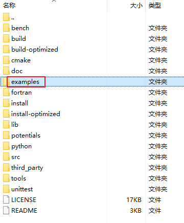

# LAMMPS 教程复现

用于记录教程的复现过程、关键参数、运行步骤、结果判断和个人理解。

## 官方教程来源1
官方教程tutorials中提供了一些案例的详细步骤，
https://lammpstutorials.github.io/sphinx/build/html/tutorial1/lennard-jones-fluid.html。
在github上有对应的输入文件和输出文件。
https://github.com/lammpstutorials/lammpstutorials-inputs
两者配合使用。
个人见解：注意lammps的版本，我之前用2022年的版本复现这些教程，需要修改很多地方，但是换了2025年的版本，就基本上不需要修改lmp文件。另外，建议先复现tutorials的内容（更详细），再复现exampls的内容。结合gpt等ai使用。

## 官方教程来源2

下载LAMMPS 软件时有一个 `examples` 文件夹，提供了很多输入文件，便于复现。多数案例包含以 `in.*` 命名的 LAMMPS 输入文件，运行后会生成log文件；部分案例还需要以 `data.*` 命名的初始结构文件。

各案例的相关内容在 LAMMPS 官方示例说明中查询。https://docs.lammps.org/Examples.html

## 已复现内容

- [LAMMPS Tutorial 4：Nanosheared Electrolyte](tutorial-4.md)
- [LAMMPS flow：二维受力 Poiseuille 流](example-flow.md)